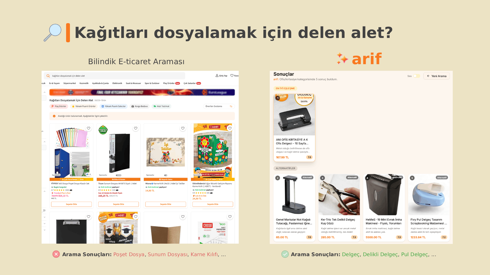

# ✨ arif (agentic retrieval with intelligent feedback)

> A multi-agent reverse search engine for e-commerce.

**arif**, e-ticaret için çok ajanlı bir yapay zeka arama motorudur. Kullanıcılar tam olarak ne aradıklarını bilmeseler bile, ürünü doğal dille tarif ederek ya da fotoğraf yükleyerek arama yapabilirler. **arif** anlar, gerektiğinde netleştirici sorular sorar ve en uygun ürünleri bulur.


## Demo

https://github.com/user-attachments/assets/f6c3057b-df20-4ce6-bec0-e663fe4291ab


## İçindekiler

- [arif'i farklı kılan ne?](#arifi-farklı-kılan-ne)
- [Demo senaryoları](#demo-senaryoları)
- [Mimari](#mimari)
- [Teknoloji yığını](#teknoloji-yığını)
- [Proje yapısı](#proje-yapısı)
- [Kurulum](#kurulum)
- [LLM modları](#llm-modları)
- [API referansı](#api-referansı)
- [Agentic döngü nasıl çalışır?](#agentic-döngü-nasıl-çalışır)
- [Dataset](#dataset)
- [Özelleştirme](#özelleştirme)


## arif'i farklı kılan ne?

Geleneksel arama motorları kullanıcının tam kelimeyi bilmesini gerektirir. **arif** bunu tersine çevirir:



| | 🔍 Geleneksel Arama | ✨ arif |
|---|---|---|
| 🔤 Girdi | "delgeç" | "Kağıtları dosyalamak için delen alet" |
| 🧠 Anlama | Anahtar kelime eşleştirme | Doğal dil anlama |
| 📖 Gereksinim | Kullanıcı ürün adını bilmeli | Kullanıcı ne hatırladığını tarif eder |
| 💬 Etkileşim | Tek seferlik sorgu | Belirsizliği gideren diyalog |
| 📸 Görsel | Desteklenmiyor | Fotoğraftan arama yapılabilir |
| 🔊 Ses | Desteklenmiyor | Sesli tarif ile arama yapılabilir |


## Demo senaryoları

### 🧮 "Adını bilmiyorum"
Kullanıcı ürünün adını hiç bilmiyor, sadece nasıl göründüğünü hatırlıyor.

```text
Kullanıcı : "Şu eski hesaplama araçları vardı ilkokulda, boncukları vardı renkli renkli"
arif      : "Plastik miydi, ahşap mıydı?"
Kullanıcı : "Ahşaptı sanırım, 10 sıra vardı"
arif      : [Abaküs sonuçları]
```

### 🛋️ "Bir yerde görmüştüm"
Kullanıcı başkasının evinde gördüğü bir ürünü arıyor.

```text
Kullanıcı : "Arkadaşımın evinde çok güzel bir lamba vardı, komidinin
             üzerinde duruyordu, retro bir tarzı vardı"
arif      : "Masa lambası mıydı, abajur gibi bir şey miydi?"
Kullanıcı : "Evet masa lambası, metal görünümlüydü"
arif      : [Retro masa lambası sonuçları]
```

### 📸 "Bir fotoğrafım var"
Kullanıcı net olmayan bir görsel yükliyor.

```text
Kullanıcı : [Bulanık bir fotoğraf yükler]
arif      : Gemini Vision ile görseli analiz eder,
             tarife dönüştürür ve arama başlatır
```

### ☕ "Annemden hatırlıyorum"
Nostaljik, belirsiz bir tarif.

```text
Kullanıcı : "Eskiden annem mutfakta kahve çekirdeğini bir aletin içine
             koyardı ve o çekirdekler toz kahve olarak çıkardı"
arif      : "Elle mi çalışıyordu, yoksa elektrikli miydi?"
Kullanıcı : "Manueldi, bakırdan retro bir görünümü vardı"
arif      : [Manuel bakır kahve değirmeni sonuçları]
```


## Mimari

```text
┌──────────────────────────────────────────────────────────┐
│                    Kullanıcı Girdisi                     │
│              (metin, görsel veya ikisi birden)           │
└──────────────┬───────────────────────┬───────────────────┘
               │                       │
          [metin yolu]           [görsel yolu]
               │                       │
               ▼                       ▼
         IntakeRouter          VisualReconstructor
                                  (Gemini Vision)
               │                       │
               └───────────┬───────────┘
                           │
                    ConceptExtractor
                    (Gemini Flash)
                           │
              ┌────────────┴────────────┐
          güven                       güven
          >= 0.75                     < 0.75
              │                         │
              │                   ClarifierAgent
              │                   (Gemini Flash)
              │                   tek soru sorar
              │                         │
              │                 (döngü, maks 3 tur)
              │                         │
              └────────────┬────────────┘
                           │
                   MarketplaceMatcher
         (Trendyol Embedding + Elasticsearch kNN)
                           │
                     ResultRanker
         (Gemini Pro - sonuçları yeniden sıralar
          ve her ürün için Türkçe gerekçe ekler)
                           │
                    En İyi Sonuçlar
```

`ClarifierAgent <-> ConceptExtractor` döngüsü temel agentic davranışı oluşturur. Sistem, arama yapmak için yeterli bilgiye sahip olup olmadığına otonom olarak karar verir ve belirsizliği gidermek için hedefli sorular sorar.


## Teknoloji yığını

| Katman | Teknoloji |
|---|---|
| Ajan orkestrasyonu | LangGraph (StateGraph + MemorySaver + interrupt/resume) |
| LLM | Google Gemini 2.5 Flash / Pro (bulut) + Gemma 4 E4B via Ollama (lokal) |
| Görsel anlama | Gemini Vision (multimodal - görsel + metin birlikte) |
| Embedding | [Trendyol/TY-ecomm-embed-multilingual-base-v1.2.0](https://huggingface.co/Trendyol/TY-ecomm-embed-multilingual-base-v1.2.0) (768-dim) |
| Arama | Elasticsearch 9.x (kNN dense vector + kategori filtresi) |
| Backend | FastAPI + Uvicorn |
| Frontend | Next.js 14 + TypeScript + Tailwind CSS + shadcn/ui |
| Ses | Web Speech API (STT + TTS, tarayıcı native) |


## Proje yapısı

```text
arif/
├── src/
│   ├── agents/          # Her ajan için ayrı dosya
│   ├── prompts/         # Sistem promptları (ajanlarla dosya adı eşleşmeli)
│   ├── api/             # FastAPI uygulaması
│   ├── config.py        # LLM mod konfigürasyonu (local / dev / test)
│   ├── graph.py         # LangGraph state machine
│   └── state.py         # Paylaşılan SearchState tanımı
├── frontend/            # Next.js uygulaması
├── scripts/
│   └── index_dataset.py # Ürünleri Elasticsearch'e indeksler
├── data/
│   ├── products.json    # Örnek dataset (2 mock ürün)
│   └── images/          # Örnek ürün görselleri
├── requirements.txt
└── .env.example
```


## Kurulum

### Gereksinimler

- Python 3.11+
- Node.js 18+
- Elasticsearch 9.x ([indir](https://www.elastic.co/downloads/elasticsearch))
- Gemini API anahtarı ([ücretsiz alın](https://aistudio.google.com/api-keys))

### 1. Klonla ve kur

```bash
git clone https://github.com/myoluk/arif.git
cd arif
python -m venv venv
venv\Scripts\activate
pip install -r requirements.txt
```

### 2. Ortam değişkenlerini ayarla

```bash
copy .env.example .env
```

`.env` dosyasını düzenle:

```env
APP_ENV=dev
GEMINI_API_KEY=anahtar_buraya
```

### 3. Dataset'i hazırla

`data/` klasörü aşağıdaki yapıda olmalıdır:

```text
data/
├── products.json
└── images/
    ├── {id}_1.jpg
    ├── {id}_2.jpg
    └── {id}_3.jpg
```

Her ürün için JSON formatı:

```json
{
  "id": "123456789",
  "title": "Örnek Ürün Başlığı",
  "description": "Ürün açıklaması.",
  "features": ["Materyal: Cam", "Hacim: 1 L"],
  "category_path": ["Ev ve Mobilya", "Sofra & Mutfak"],
  "category": "demlik & çaydanlık",
  "brand": "Örnek Marka",
  "price_try": 299.90,
  "rating": 4.5,
  "review_count": 128,
  "source": {
    "site": "common",
    "url": "",
    "collected_at": "2026-01-01T00:00:00Z"
  }
}
```

Repo ile birlikte 2 örnek ürün ve görselleri `data/` klasöründe gelir. Kendi dataset'inizle kullanmak için:

```bash
# Varsayılan (data/ klasörü)
python scripts/index_dataset.py

# Özel klasör
python scripts/index_dataset.py --data-dir /path/to/your/data
```

### 4. Uygulamayı başlat

```bash
# Backend (port 8000)
uvicorn src.api.main:app --reload --port 8000

# Frontend (port 3000)
cd frontend
npm install
npm run dev
```

[http://localhost:3000](http://localhost:3000) adresini açın.

`products.json` içindeki bir ürünü aramayı deneyin.

**Not:** *Arama yapabilmek için **Elasticsearch** aktif olmalıdır.*

---

## LLM modları

| Mod | `APP_ENV` | LLM | Kullanım amacı |
|---|---|---|---|
| Lokal | `local` | Ollama + Gemma 4 E4B | Çevrimdışı geliştirme, API maliyeti yok |
| Geliştirme | `dev` | Gemini 2.5 Flash-Lite | Gemini ile hızlı iterasyon |
| Test | `test` | Gemini 2.5 Flash + Pro | Üretim kalitesi çıktı |


## API referansı

| Endpoint | Metot | Açıklama |
|---|---|---|
| `/search` | POST | Yeni arama oturumu başlat |
| `/answer` | POST | Netleştirme sorusuna cevap ver |
| `/health` | GET | Servis sağlık kontrolü |
| `/images/{dosyaadi}` | GET | Ürün görsellerini sun |

### Örnek akış

```bash
# Arama başlat
curl -X POST http://localhost:8000/search \
  -F "user_input=tahta kulplu japon demlik"

# Netleştirme gerektiğinde yanıt:
# {"session_id": "...", "status": "clarifying", "question": "Gövdesi porselen mi?"}

# Soruyu cevapla
curl -X POST http://localhost:8000/answer \
  -H "Content-Type: application/json" \
  -d '{"session_id": "...", "answer": "evet porselen"}'

# Sonuçlarla yanıt:
# {"session_id": "...", "status": "results", "results": [...]}
```


## Agentic döngü nasıl çalışır?

1. **ConceptExtractor**, kullanıcının tarifini yapılandırılmış özelliklere ve bir güven skoruna (0-1) dönüştürür.
2. Güven < 0.75 ise **ClarifierAgent**, en ayırt edici belirsizliği seçer ve tek bir hedefli soru sorar.
3. Cevap orijinal tarife eklenir, ConceptExtractor yeni bağlamla yeniden değerlendirir.
4. Bu döngü güven >= 0.75 olana veya 3 tur tamamlanana kadar devam eder.
5. **MarketplaceMatcher**, son tarifi Trendyol embedding modeli ile kodlar ve kNN araması yapar.
6. **ResultRanker**, sonuçları kullanıcı niyetine göre yeniden sıralar ve her ürün için Türkçe gerekçe ekler.


## Dataset

Ürünler 10 kategori genelinde manuel olarak toplanmıştır:

- `Demlik & çaydanlık`
- `Spor ayakkabı`
- `Sofra ve mutfak`
- `Aydınlatma`
- `Ev tekstili`
- `Oyuncak`
- `Elektrikli ev aletleri`
- `Kişisel bakım`
- `Ev dekor`
- `Ofis/kırtasiye`


## Özelleştirme

### Yeni kategori eklemek

1. `src/config.py` dosyasındaki `CATEGORIES` listesine yeni kategoriyi ekleyin (küçük harf):

   ```python
   CATEGORIES = [
       "demlik & çaydanlık",
       "yeni kategori adı",   # eklenen
       ...
   ]
   ```

2. `products.json`'a yeni kategorideki ürünleri aynı formatta ekleyin.

3. ES'i yeniden indeksleyin:

   ```bash
   python scripts/index_dataset.py
   ```

---

*Built for BTK Akademi Hackathon 2026, e-commerce track.*